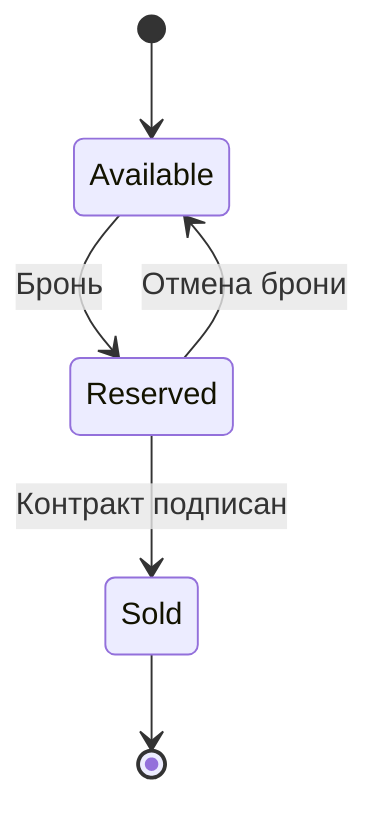
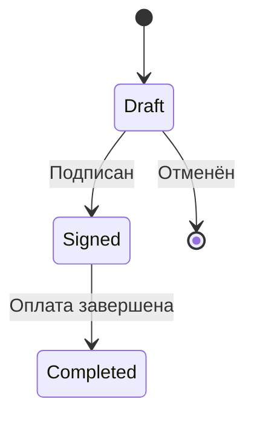
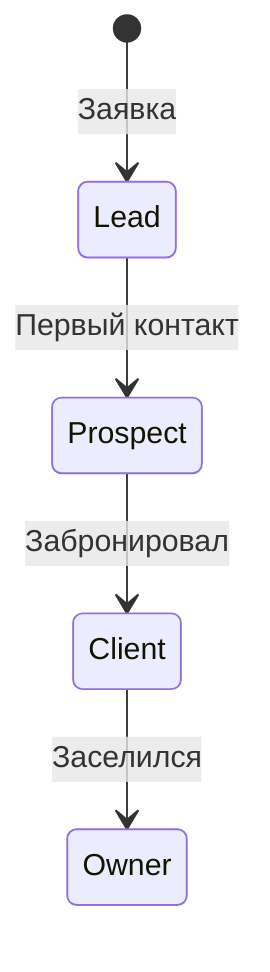

# Статусные модели (Brusnika)

## 1. Квартира

```mermaid
stateDiagram-v2
    [*] --> Available
    Available --> Reserved : Бронь
    Reserved --> Sold : Контракт подписан
    Reserved --> Available : Отмена брони
    Sold --> [*]
```

## 2. Контракт

```mermaid
stateDiagram-v2
    [*] --> Draft
    Draft --> Signed : Подписан
    Signed --> Completed : Оплата завершена
    Draft --> [*] : Отменён
```

## 3. Клиент (воронка продаж)

```mermaid
stateDiagram-v2
    [*] --> Lead : Заявка
    Lead --> Prospect : Первый контакт
    Prospect --> Client : Забронировал
    Client --> Owner : Заселился
```
